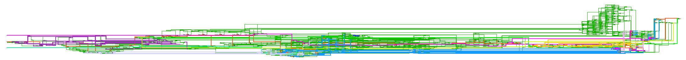
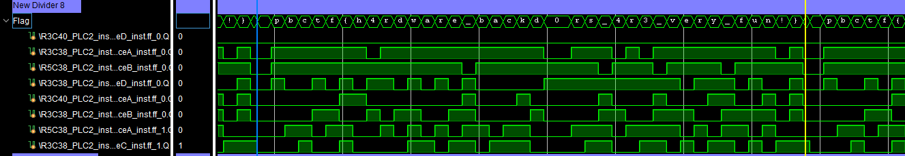

# LLLattice
## Prompt:

It seems like there is a UART echoserver design running on a Lattice FPGA. The UART bus runs 8N1 at a rate of 100 clocks per symbol. Can you reverse it and find out what secret it holds?

Attachment: [chal.bit](chal.bit)

Author: VoidMercy

"Hint": [This repo](https://github.com/VoidMercy/Lattice-ECP5-Bitstream-Decompiler/tree/e4659cb6fbc19c749a5f859f85fdadd19c7f9147) was updated halfway through the CTF. Prior to this update, it was not able to fully process the provided bitstream, and afterward it worked.


## Background:

This problem is very similar to Pwn2Win 2021's `Ethernet from Above` challenge, which also involved reversing a lattice bitstream. While I did attempt this challenge at the time, I was unable to complete it. An excelent writeup from Robert Xiao of Maple Bacon is available [here](https://ubcctf.github.io/2021/06/pwn2win-ethernetfromabove/).
That said, having attempted this challenge helped me significantly as I had some tooling already prepared. 

Also of note, I did not actually complete this challenge during the competition - I found the solution ~10 seconds after the competition ended, and had the full flag approximately 2 minutes late. 

## Process:

In solving this problem, I initially used a conglomeration of Xiao's scripts and a variety of tools and scripts I had from my attempts at solving Ethernet From Above (Vivado, prjtrellis, etc.). While I sucessfully used these tools to extract verilog, I was unable to accurately simulate the verilog, and static analysis was a non-starter.

During this time I tried using VoidMercy's Lattice decompiler, but quickly realized it wasn't compatible with the provided chal.bit, and decided this was probably a red herring. This turned out to be mostly true, until the hint was released. At this point I pivoted to a clean installation of VoidMercy's decompiler, and managed to complete the challenge in that way. The solution below starts at this point.

# Solution

1. Inspect chal.bit in a hex editor. Conveniently, the header includes the plaintext: `Part: LFE5U-25F-6CABGA381`. Now I know the specific FPGA that this challenge is using, and am able to start the decompile process.
2. Use [VoidMercy's decompiler tool](https://github.com/VoidMercy/Lattice-ECP5-Bitstream-Decompiler) to extract verilog.
3. Collapse Lattice "slice" cells to simplified RTL with yosys:
   ```
   read_verilog chal.v
   synth
   flatten
   opt
   clean
   opt_clean
   write_verilog chal_opt.v
   ```
4. Create Vivado project with `chal_opt.v`

   The top level has just 4 io wires: 
   - `MIB_R0C60_PIOT0_JPADDIA_PIO`
     - (Input)
   - `G_HPBX0000`
     - (Input - on a clock capable pin)
   - `MIB_R0C40_PIOT0_JPADDIB_PIO`
     - (Input)
   - `MIB_R0C40_PIOT0_JTXDATA0A_SIOLOGIC`
     - (Output)

   At this point, I know from the challenge prompt that this is supposed to be some sort of 8N1 echo server, so I begin by creating a testbench to send serial data. The final version is in [top_tb.sv](top_tb.sv).  

5. The next step was to determine which IO did what. The output was pretty obvious, as was the clock pin, but at first I couldn't tell what the two input did. For this, I generated a schematic using Vivado's RTL analysis. 

This actually provides some very useful information. For one, I can immediately differentiate the three input ports. 
   - `G_HPBX0000` (red) drives the clock pins of all of FF registers, which proves that this is indeed the clock input.
   - `MIB_R0C60_PIOT0_JPADDIA_PIO` (hot pink) drives the CLR/RST line of many (but notably not all) of the FFs, implying it is almost certainly the reset line.
   - `MIB_R0C40_PIOT0_JPADDIB_PIO` (neon green) drives two FFs in series, acting as a 2FF synchronizer. This strongly implies this is the uart data input line.

6. I then continued doing preliminary static analysis on this design. I found certain sections that appeared to be counters (2x "100" counters for bit timing, bits within byte counter (surprisingly the input data was captured via a mux instead of a fifo), etc.), and a few other clearly related chunks of registers. I did my best to color code these chunks, and they can be seen in the attached [schematic.pdf](schematic.pdf)

7. From here, I began stimulating the design. I configured Vivado to capture the output of every single flipflop, and grouped the flop outputs as best I could in the waveform inspector. Using the testbench, I tried various hypothesis as to how I could get any output from the circuit. These ideas included sending each possible byte (with resets inbetween) looking for any change in the recorded state, sending large quantities of data, malformed bytes, etc. However, for all my attempts, I couldn't find any data-dependency within the flops for any of these actions (excluding the RX decoding logic itself), and I couldn't manage to get the circuit to send anything at all to the output.

8. Since the stimulus-only attempt failed, it was time to start forcing some responses - literally. I selected a variety of interesting signals (i.e. those that drove clock enables, or otherwise seemed likely to have significant impact), and started forcing them to various states. While I started this process methodically determining what each signal did, I eventually started asserting signals in bulk. I eventually determined that this set of forces yielded some interesting signals in the waveform.
   ```
   force top_wrap.top.\R4C37_PLC2_inst.sliceA_inst.ff_1.Q = 0;  //Doesn't do much on its own.
   force top_wrap.top.\R3C37_PLC2_inst.sliceC_inst.ff_0.Q = 1; //CE for output reg
   force top_wrap.top.\R3C37_PLC2_inst.sliceD_inst.genblk9.lut4_0.D = 1; // 8 parallel regs, maybe output buffer?
   force top_wrap.top.\R3C38_PLC2_inst.sliceA_inst.genblk9.lut4_0.D = 1;
   force top_wrap.top.\R3C37_PLC2_inst.sliceD_inst.genblk9.lut4_0.D = 1;
   force top_wrap.top.\R2C39_PLC2_inst.sliceD_inst.ff_0.CE = 1;

   rst = 1;
   ```

   By doing this, a set of 8 registers that seemed grouped in the schematic started seemingly randomly toggling. From here it was a matter of guessing the correct order of bits (made easier knowing that the flag started with `pbctf{` ), and now we can see the plaintext of the flag:

   

   Also: I will note that what I thought was a rst signal definitely is not an actual reset signal. I don't know exactly what it is though.


# Review
Overall, I really enjoyed this challenge, and believe it was an appropriately difficult challenge for this relatively young genre of CTF challenge- hardware reversing. While the tooling for fpga bitstream reversing is certainly underdeveloped, I hope that more challenges of this style will improve the situation.

This problem in particular took ~20 hours of work, ~12h of which was after VoidMercy's repo update. This was also my first time reverse engineering verilog, so I'd like to think I'd be quicker if I did it again. After all, this design only has 42 flip flops, of which at least half are related to the uart TX/RX modules. 

## Review of hardware-challenges in general:

My current toolchain leaves lots to be desired. Off the top of my head, my RE-focused-verilog-tools wishlist includes:
- Schematic viewing: adding notes (beyond just color coding), grouping logic, abstracting away modules as they are resolved.
  - This is mostly doable already in Vivado, but is far from convenient.
  - Auto-simplification
    - yosys already removed unused logic, but there were still plenty of cases of multiple "not" gates in a row, or relatively complicated combinational logic that could have lived in a single truth table.
- Rapid fuzzing
  - Running simulations took a significant amount of time, and I had to write code defining each one. For example, if I had a good way to abstract away the UART RX module, I could have wired the tooling in to _after_ said module and sped up the simulations by ~1000x (# of cycles/byte received)
  - A way to save partial simulation state - Not so relevant for this challenge, but would have helped on `Ethernet from Above` from Pwn2Win.

 

